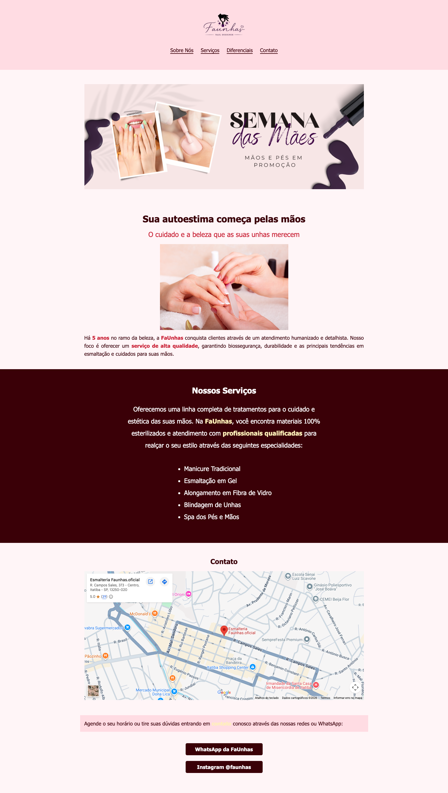

# 💅 FaUnhas - Esmalteria

> Projeto desenvolvido como o Checkpoint Final da trilha Primeiros Passos da DevMedia, aplicando conceitos fundamentais de desenvolvimento web em um cenário de comércio local.

Este projeto consiste em uma landing page para uma esmalteria fictícia inspirada no negócio real da minha mãe, desenvolvida utilizando apenas **HTML5** e **CSS3**. O objetivo foi praticar a estruturação de páginas, organização do código, alternância de estilos por seções e versionamento com Git.

---

## 🚀 Demonstração

🔗 [Clique aqui para visitar o projeto rodando ao vivo](https://faunhas-j4er.vercel.app/)

---

## 📸 Preview



---

## 🛠️ Tecnologias Utilizadas

- HTML5
- CSS3
- Google Maps Embed
- Git
- GitHub

---

## 📚 Conceitos Praticados

Durante o desenvolvimento deste projeto foram aplicados conceitos como:

- Estruturação de páginas com HTML5;
- Organização de arquivos e diretórios;
- Seletores e classes CSS;
- Alternância de cores e contraste entre seções;
- Estilização de textos, listas e links;
- Criação de links âncora para navegação interna;
- Incorporação de mapas utilizando Google Maps;
- Versionamento de código com Git;
- Boas práticas de commits utilizando GitHub.

---

## 📁 Estrutura do Projeto

```text
faunhas/
├── assets/
│   ├── banner-faunhas.png
│   ├── logo-faunhas.png
│   └── manicure-assinatura.png
├── index.html
├── style.css
└── README.md
```

---

## 🎯 Objetivo

O principal objetivo deste projeto foi validar os conhecimentos adquiridos na trilha de introdução, construindo uma página estática completa de ponta a ponta e adaptando um layout existente para uma nova identidade visual e proposta de negócio.

---

## 📌 Aprendizados

Ao concluir este projeto, pratiquei:

- Criação de uma página web completa e semântica utilizando HTML5;
- Estilização de layouts aplicando uma paleta de cores personalizada com CSS3;
- Uso de classes CSS para manter o código limpo e organizado;
- Estruturação de um projeto Front-end simples e funcional;
- Versionamento incremental com Git e GitHub através de commits organizados em cada etapa do desenvolvimento.

---

## 👨‍💻 Autor

Desenvolvido por **Lincoln Berto**.

- **Portfólio:** https://lincolnberto.com
- **LinkedIn:** https://linkedin.com
- **GitHub:** https://github.com
